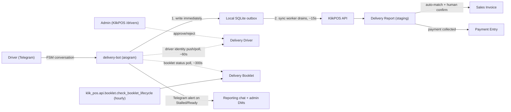

# Delivery Bot Integration — Architecture & Flows

Internal reference for how KlikPOS and the Telegram delivery bot (`hd-delivery-telegram`, a
separate repo) work together. Complements `implementation_plan.md` (the phased build history) and
`bugs.md` (known issues/follow-ups) — this doc explains *how the running system behaves*, not how
it was built or what's still owed. If code and this doc ever disagree, trust the code and fix this
doc.

**Companion repo:** `hd-delivery-telegram`, cloned locally at `/home/frappe/prod/hd-delivery-telegram`
(GitHub `taraphirun/hd-delivery-telegram`) — corrected 2026-08-02, an earlier version of this doc
(and this session's own environment config) pointed at a now-nonexistent `/home/frappe/dev/...`
path. Two independent git repos, two independent deploys, connected only over HTTP via the API
described below.

---

## The two systems

| | KlikPOS (this repo) | Delivery bot (`hd-delivery-telegram`) |
|---|---|---|
| Stack | Frappe/Python backend, React/Vite SPA (`klik_spa`) | Python/aiogram bot (`delivery-bot/`); a legacy NestJS backend + Next.js dashboard (Postgres via Prisma, OCR service, MinIO) also exist as a separate deploy - **still actively used**, not retired (see correction below) |
| Owns | Sales Invoices, Delivery Reports, Delivery Drivers, Delivery Booklets, reconciliation, payments | The Telegram conversation with drivers; a local SQLite outbox as a durable capture buffer; polls KlikPOS for driver/booklet status changes |
| Source of truth for | Delivery Report data once synced; Delivery Driver status; Delivery Booklet registry/lifecycle (as of Module 16) | Nothing long-term — it's a thin, offline-first capture + relay client |

> **Correction (2026-08-02, Module 16):** an earlier version of this doc claimed the legacy NestJS
> dashboard was "unused, confirmed retired by the user." That was wrong - the user's own
> screenshot showed a live, real "Booklet #71 is STALLED!" Telegram alert firing from that stack's
> booklet-lifecycle cron. It remains a separate deploy with its own Postgres DB, still running,
> still used for at least the booklet feature (until Module 16's KlikPOS-side booklet registry
> fully replaces it - a hard cutover once verified, not yet done as of this doc).



---

## Flow 1: Delivery capture (bot side)

A driver's conversation with the bot is a linear FSM (`delivery-bot/bot.py`):

```
📍 share location → type invoice number → ✅ Full / ⚠️ Partial
  → 🟢 Paid / 🔴 Unpaid / 🟡 Partial → send photo(s) → 🎙️ voice note (or ⏩ skip if Full)
  → finalize
```

**On finalize** (`finalize_delivery()`), in this exact order — the order matters:

1. **Photos/voice downloaded from Telegram to local disk** (`download_media_locally`) — safe to do
   synchronously here since the bot already has a live Telegram connection to be mid-conversation
   at all.
2. **Written to the local SQLite outbox** (`local_store.insert_delivery`, table `outbox` in
   `delivery-bot/deliveries.sqlite`) with `sync_status = 'Not Synced'`. **This is what the driver's
   success/failure message is based on.** If this succeeds, the delivery is safe — everything
   after this point is best-effort.
3. **Legacy Postgres dual-write** (`delivery_bot.delivery_logs` + `public.Invoice`, MinIO for
   photos) — kept only so the old NestJS dashboard still shows deliveries during the transition.
   Wrapped so a failure here (e.g. MinIO down) is logged and swallowed, never surfaced to the
   driver as an error. **This path is legacy and will be removed** (Todo 036, not yet scheduled).

`bot_delivery_id` (a UUID generated once at capture) is the idempotency key used everywhere
downstream — KlikPOS will never create two Delivery Reports for the same one.

## Flow 2: Sync to KlikPOS (bot → KlikPOS)

`delivery-bot/sync_worker.py`, a background loop (`SYNC_INTERVAL_SECONDS`, default 15s) started
alongside the bot's Telegram polling:

1. Pull `Not Synced` outbox rows (skips ones still in backoff — see below).
2. `POST /api/method/klik_pos.api.delivery.submit_delivery_report` — idempotent on
   `bot_delivery_id`; also runs KlikPOS's auto-match (exact → normalized → fuzzy invoice number)
   against Sales Invoices.
3. On success, upload each local photo/voice file via
   `POST .../klik_pos.api.delivery.upload_delivery_file` (**not** Frappe's stock `/api/method/upload_file`
   — that one rejects `.ogg` voice notes for any non-Desk-access user; this bot's service account
   deliberately has no Desk access, so a dedicated endpoint bypasses that specific MIME allowlist
   via `save_file()` directly), then `POST .../attach_delivery_media` to record the URLs on the
   report. Local files are only deleted after a confirmed successful attach.
4. Mark the row `Synced` (store the KlikPOS Delivery Report name) — or `Failed`/leave `Not Synced`,
   see below.

**Error handling**: Frappe whitelisted methods return HTTP 200 with `{"success": false, ...}` for
validation failures, not a 4xx status. So:
- Network error / timeout / HTTP 5xx → **transient** → stays `Not Synced`, retried with backoff
  (`min(300s, interval × 2^attempts)`), unless it's failed 15 times in a row (`SYNC_MAX_ATTEMPTS`)
  — then it's flipped to `Failed` too, since that many consecutive failures to even *reach* the
  server isn't a blip.
- `success: false` in the response body → **permanent** → `Failed` immediately, regardless of
  attempt count (retrying the identical payload against the identical validation rule can't help).
- `Failed` rows are **not** auto-retried. Check `/syncstatus` in the bot (admin-only) for recent
  failures + `last_sync_error`. Resetting one currently requires a direct SQLite edit
  (`UPDATE outbox SET sync_status='Not Synced' WHERE bot_delivery_id=...`) — no admin command for
  this yet.

## Flow 3: Reconciliation (KlikPOS side)

A synced delivery lands as a `Delivery Report` (staging doctype) with `reconciliation_status`:
`Unmatched` → `Suggested` (auto-matched, with a confidence score) → `Confirmed` / `Rejected`.
Staff work the queue at `/deliveries/reconcile`:

- **Confirm**: stamps delivery status/driver/GPS onto the matched Sales Invoice, and — if the
  driver reported payment collected — posts a `Payment Entry` via the existing
  `create_payment_entry` (never re-implemented).
- **Reject**: flips status only, never touches the invoice.
- **Re-match**: manually pick a different invoice (searches outstanding invoices, scoped to the
  current company/POS profile).

**An invoice can legitimately receive more than one confirmed Delivery Report** — a Partial
delivery now, the remainder later. Two guards make this safe regardless of confirm order (the
queue lists newest-submission-first, so a later Full delivery is often confirmed before an earlier
Partial one): `custom_delivery_status` on the invoice is monotonic (never regresses), and the
driver/GPS/delivered-at snapshot only moves forward by `delivery_timestamp`, not confirm order.
The queue itself groups reports by invoice and floats "flagged" groups (multiple reports, or any
Partial) to the top so staff notice these cases.

Payment posting is always safe against double-charging — it checks the invoice's *live*
`outstanding_amount` on every confirm, never a cached value.

## Flow 4: Driver identity (two-way sync)

KlikPOS's `Delivery Driver` doctype is the **system of record** for driver status — approvals
happen in KlikPOS (`/drivers` page), not just in the bot. (Named `Delivery Driver`, not `Driver` —
ERPNext core already owns that doctype name for fleet/employee management, unrelated to this.)

**Push** (bot → KlikPOS, `delivery-bot/driver_sync.py::push_driver_to_klikpos`): called right after
a `/register` signup, and again whenever the bot's own Telegram approve/reject buttons are used —
creates/updates the KlikPOS record via `sync_driver_from_bot` (matches on `bot_driver_id`, falling
back to `telegram_user_id`) and pushes any status change immediately.

**Poll** (KlikPOS → bot, `driver_sync.py::poll_klikpos_status`, background loop, default 60s): the
mechanism that makes an approval made *from KlikPOS's own `/drivers` page* actually reach the bot.
Fetches current statuses via `list_drivers`, and for any driver whose KlikPOS status differs from
the bot's local Postgres `Driver.status`, pulls it down — updates local Postgres, updates the
in-memory `allowed_drivers` set (which gates the delivery flow), and DMs the driver
("🎉 approved" / "❌ not approved").

Precedence: **KlikPOS wins on status and profile fields; the bot wins only on the Telegram-identity
fields it uniquely knows** (`telegram_user_id`, `telegram_username`, `chat_id`) — pushing driver
data never overwrites a status or name change a human made in KlikPOS.

All push/poll calls are best-effort: a KlikPOS-side failure is logged, never raised — the bot's own
registration/approval flow keeps working standalone if KlikPOS happens to be unreachable.

## Flow 5: Booklet lifecycle (KlikPOS → bot poll, Module 16)

A `Delivery Booklet` is the registry entry for a physical paper invoice book: a number range,
optionally dedicated to one VIP customer. `submit_delivery_report` resolves a report's
`reported_invoice_no` against this registry at ingestion time (same idea as Sales Invoice
matching), and `klik_pos.api.booklet.check_booklet_lifecycle` (hourly scheduler job) computes each
open booklet's status: `Active` → `Stalled` (no matching report within the configured window) →
`Ready for Review` (pages filled or end number reached) → `Closed` (staff sign-off, terminal).

KlikPOS computes status only — it has no Telegram integration of its own. Turning a status change
into a Telegram alert is the bot's job, via the same **poll, never push** pattern as Flow 4's
driver sync: `delivery-bot/booklet_sync.py::poll_klikpos_booklets` (background loop, default 300s)
fetches every booklet's current status via `list_booklets`, and alerts (broadcast to the reporting
chat + DM every admin) only on an observed transition into `Stalled`/`Ready for Review` — a
persistent SQLite table (`local_store.booklet_status`) remembers the last-seen status per booklet
so a re-poll of an unchanged status, or a bot restart, doesn't re-fire the same alert.

This direction was a deliberate choice, not the default: the user's first instinct was a
klik_pos → bot webhook, but `driver_sync.py`'s existing "KlikPOS → bot is poll-only" precedent
(Flow 4) was surfaced and the user switched to matching it — the bot has no inbound HTTP surface
at all today, and a webhook would have added the first one just for this.

---

## Configuration

- **KlikPOS API user**: `delivery-bot@hd-telegram.local` — a dedicated, minimal-privilege Frappe
  user (role `Delivery Bot`, no System Manager). The KlikPOS endpoints below write with
  `ignore_permissions=True` internally, so this account just needs to be a valid authenticated
  session — except `upload_delivery_file`, which needs a real `create`/`write` Custom DocPerm on
  `Delivery Report` (granted to the `Delivery Bot` role) because it goes through the normal
  document-save path.
- **Credentials**: `delivery-bot/.env` in the bot repo — `KLIKPOS_BASE_URL`, `KLIKPOS_API_KEY`,
  `KLIKPOS_API_SECRET`, alongside the bot's own `DATABASE_URL`/`DELIVERY_BOT_TOKEN`/`REDIS_URL`/
  `MINIO_*`. This file is gitignored (it wasn't originally — real secrets were committed in git
  history before that was fixed; rotate them if that history is ever shared). Copy `.env.example`
  to `.env` and fill in real values to run the bot.
- **Google Maps API key** (unrelated to the bot, but same "external config" pattern): lives on
  KlikPOS's **POS Profile** (`custom_google_maps_api_key`), for the `/deliveries/map` live map —
  set per-profile in Desk, not a site-wide setting.

## Running the bot locally

```bash
cd /home/frappe/prod/hd-delivery-telegram/delivery-bot
python3 -m venv venv && ./venv/bin/pip install -r requirements.txt   # first time only
./venv/bin/python bot.py
```
Only one process can poll a given bot token at a time — check nothing else (e.g. a docker-compose
deployment) is already running it before starting a second instance.

---

## Key files

**KlikPOS** (`klik_pos/api/`):
- `delivery.py` — `submit_delivery_report`, `get_delivery_reports`, `confirm_delivery_match`,
  `reject_delivery_match`, `rematch_delivery_report`, `upload_delivery_file`,
  `attach_delivery_media`, `create_invoice_from_delivery_report`.
- `driver.py` — `list_drivers`, `upsert_driver`, `set_driver_status`, `sync_driver_from_bot`.
- `booklet.py` — `list_booklets`, `upsert_booklet`, `close_booklet`, `delete_booklet`,
  `get_candidate_booklets`, `resolve_booklet`, `get_booklet_gaps`, `get/update_booklet_settings`,
  `check_booklet_lifecycle` (hourly scheduler job), `match_booklet_for_invoice` (ingestion helper).
- Doctypes: `Delivery Report` (staging), `Delivery Driver`, `Delivery Booklet`,
  `Delivery Booklet Settings`. Custom fields on `Sales Invoice`: `custom_delivery_status`,
  `custom_delivery_driver` (Link), `custom_delivered_at`, `custom_delivery_gps_latitude/longitude`,
  `custom_delivery_report`.
- Frontend (`klik_spa/src/`): `pages/DeliveryReconciliationPage.tsx`, `pages/DriverManagementPage.tsx`,
  `pages/LiveDeliveryMapPage.tsx`, `pages/BookletsPage.tsx`, `services/delivery.ts`,
  `services/driver.ts`, `services/booklet.ts`, `utils/realtime.ts` (socket.io client for live map
  updates), `components/delivery/CreateInvoiceFromReportModal.tsx`,
  `components/delivery/DeliveryPhotoStrip.tsx`.

**Bot** (`delivery-bot/`):
- `bot.py` — the FSM, Telegram handlers, registration/approval.
- `local_store.py` — SQLite outbox schema + CRUD, plus the `booklet_status` table booklet_sync.py
  uses to track alert-worthy transitions.
- `sync_worker.py` — delivery sync loop.
- `driver_sync.py` — driver identity push/poll loop.
- `booklet_sync.py` — booklet status poll + Telegram alert loop (Module 16, Flow 5).
- `klikpos_client.py` — shared KlikPOS HTTP client config (base URL, auth headers).

## Known gaps (not bugs — deliberately unbuilt so far)

- No driver-facing "my recent deliveries + sync status" list in the bot — only the admin
  `/syncstatus` command (aggregate counts + recent failures).
- `Failed` sync rows need a manual SQLite edit to retry (see Flow 2).
- Module 16's bot-side half (`booklet_sync.py`) has never been run against a live Telegram bot
  process or exercised end-to-end against the real `hd.phirun.me` KlikPOS instance together - see
  `todo/043.md`'s Known gaps.
- Todo 036 (retiring the bot's legacy NestJS/Postgres/Redis/MinIO/ocr-service stack) is not
  started — needs a monitored parallel-run window first, see `phases/phase-13.md`.

For the phased build history and current status of every module, see `implementation_plan.md` and
`phases/phase-0{9,10,12,13}.md` and `phases/phase-1{4,5}.md`. For active issues, see `bugs.md`.
